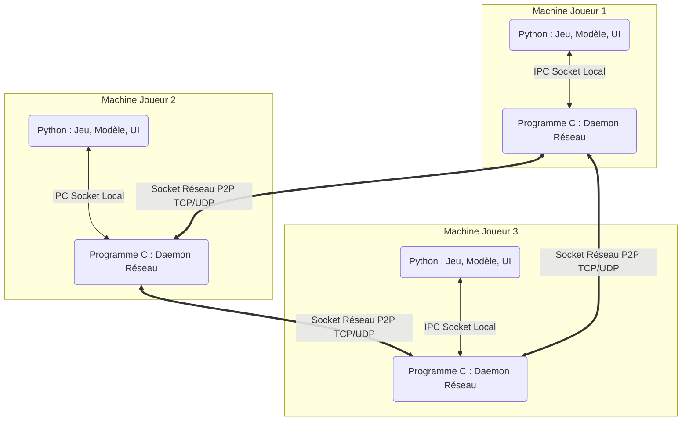
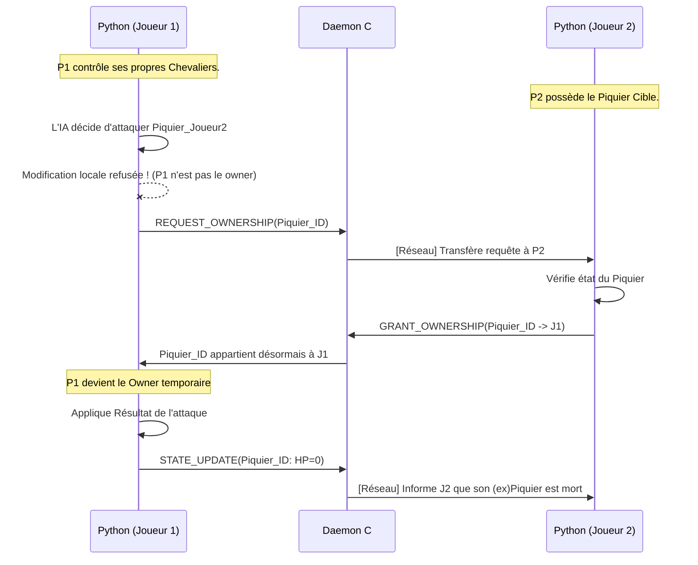

# Architecture Distribuée P2P (Bataille d'IAs)

Ce document détaille l'architecture mise en place pour transformer la simulation de bataille locale en un jeu réseau à grande échelle et sans serveur (Peer-to-Peer).

## 1. La Topologie "Double Processus"

Pour ce projet, nous utilisons une topologie hybride par nœud : le traitement métier/jeux (Python) est séparé du traitement du trafic réseau (Dæmon C).
Ces deux processus tournent sur la même machine (client) et communiquent entre eux via l'**Inter-Process Communication (IPC)** par Sockets.

### Le Rôle du Python
Le processus Python ne manipule *jamais* d'IP réseau ni de P2P. Son unique préoccupation est de pousser des états (`STATE_UPDATE`) et de formuler des demandes d'autorisation (`REQUEST_OWNERSHIP`) à son dæmon C local (via `network/ipc_client.py`).

### Le Rôle du Daemon C
Le processus C fait office de routeur. Il sait gérer la topologie d'anneau P2P, le *broadcasting* d'états, et la ré-injection des paquets reçus du monde extérieur vers le port local de son processus Python. 

---

## 2. Le Modèle de Cohérence "Network Ownership"

L'absence de serveur (autorité centrale) oblige le jeu à régler les conflits d'état de façon distribuée. Nous avons assigné à *chaque unité* du jeu un attribut `network_owner`.

### Règle d'Or de la Propriété Réseau
> **Un processus Python ne peut modifier le statut (Points de vie, Position) que des unités pour lesquelles il est certifié être le `network_owner` actuel.**

## 3. Détail du Refactoring Réalisé

Pour préparer le code original au P2P, un nettoyage architectural profond a été effectué pour garantir le motif **Modèle, Vue, Contrôleur (MVC)** pur.

### A. Isoler la Vue
Les anciennes boucles de code du jeu qui prenaient les *inputs* utilisateur passaient directement par `pygame` à divers endroits (`visual_simulation.py`, `presenter/battle.py`).
Maintenant, tout a été encapsulé dans les méthodes de `GUI` situées dans `view/views.py`. 
- `init_window()`
- `render_frame()`
- `pump_events()`

**Le cœur du jeu ne dépend plus ni n'importe plus JAMAIS la librairie graphique Pygame.**

### B. Primitives P2P dans le Modèle
Dans les sous-classes de `guerrier.py` (Knight, Pikeman, etc...) :
- **Identifiants** : Un `uuid` hexadécimal est injecté aléatoirement à chaque instanciation pour identifier l'unité à travers le monde sans collision.
- **Sérialisation** : La fonction `get_sync_data()` a été ajoutée pour émettre un état ultra léger `JSON` qui remplace les dumps `Pickle` complexes et lourds sur le réseau.
- **Mise à Jour Dictée** : La fonction `update_from_sync()` permet de forcer la mise à jour des statistiques via `dict` provenant d'un état reçu du réseau.

### C. Gestion de Scène P2P (Game Engine)
- Dans `game.py`, la méthode `apply_sync_state()` écoute le monde, mais ne mettra à jour que les unités que les "Autres" gèrent. Elle est codée pour ignorer aveuglément les données entrantes concernant les unités gérées localement par le joueur, évitant ainsi un effet yo-yo indésirable de désynchronisation !
