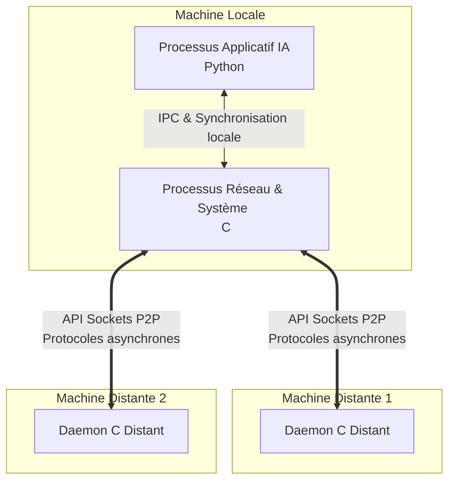
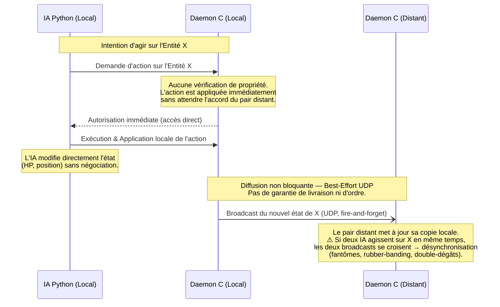

# Infrastructure Répartie pour Compétition d'IAs Distribuées

## 📌 Introduction et Objectifs
Ce projet implémente une **infrastructure réseau décentralisée à large échelle** permettant la compétition d'Intelligences Artificielles. Contrairement aux architectures client-serveur classiques, l'objectif est d'assurer une bataille multi-participants dans un environnement **pur Pair-à-Pair (P2P)**, sans aucun serveur central ou point de défaillance unique.
*(Auteur original du concept : Christian Toinard)*

## 🎯 Enjeux Techniques
L'absence de serveur central pose le défi majeur du **maintien de la cohérence de l'état distribué**. 
L'enjeu principal réside dans l'antinomie classique des systèmes répartis : **Cohérence vs Concurrence**. Comment garantir que deux processus distants ne modifient pas la même entité simultanément de manière conflictuelle tout en maintenant des performances d'exécution hautement concurrentes ? Le projet répond à cette problématique par une séparation stricte des responsabilités et un modèle de propriété innovant.

## ⚙️ Architecture Multi-Processus
Pour dissocier la logique applicative (l'IA) de la plomberie réseau et système, l'architecture impose une **séparation obligatoire en deux processus distincts** sur chaque machine locale :
1. **Le Processus Réseau (C) :** Gère les connexions non bloquantes, les Sockets de bas niveau, et les threads de routage. Il est responsable de la consistance inter-noeuds.
2. **Le Processus Applicatif / IA (Python) :** Évalue la scène, exécute les heuristiques et demande des actions.

Ces deux entités communiquent localement via des mécanismes de **Communication Inter-Processus (IPC)** (ex: sockets locaux, mémoires partagées ou files de messages) et s'appuient sur des primitives de synchronisation (Sémaphores/Mutex) pour éviter les accès concurrents locaux.

### Schéma de Déploiement Logiciel



## 🔒 Protocole de Cohérence Décentralisé
Pour résoudre les conflits sans arbitre centralisé, l'architecture s'appuie sur le concept de **"Propriété Réseau" (Network Ownership) cessible**.

Le modèle garantit l'intégrité de la scène (personnages, objets, cases) :
- Une entité (ex: une unité sur la carte) possède un unique "propriétaire" sur le réseau P2P à un instant $t$.
- Seul le nœud propriétaire a le droit d'altérer l'état de cette entité.
- Si une machine distante souhaite modifier cette entité, elle doit d'abord demander le transfert de la Propriété Réseau aux pairs.
- Une fois l'action effectuée par le propriétaire, le nouvel état est diffusé de manière **Best-effort** aux autres copies locales.

### Flux d'Exécution d'une Action



## 🛠️ Contexte Technique
- **Langages de programmation :** C (Couche Système, Routage et Réseau), Python (Couche Applicative et IA).
- **Infrastructures Systèmes :** Threads POSIX / Windows, Sémaphores, Mutex.
- **Réseau :** API Sockets UNIX/Windows (UDP/TCP), Communication Inter-Processus (IPC).

---

## 🚀 Comment tester la V1 en local

Le routeur réseau est compilé depuis `reseau.c`. `reseau.exe` est déjà compilé. Voici les **4 commandes**, une par terminal, dans l'ordre :

> ⚠️ **Ordre obligatoire** : lancez les daemons C (T1 et T3) **avant** les jeux Python (T2 et T4).

**Terminal 1 — Daemon C Joueur A**
```bash
.\reseau.exe 6000 127.0.0.1 6001 5000 5001
```

**Terminal 2 — Jeu Joueur A**
```bash
py launch.py
```

**Terminal 3 — Daemon C Joueur B**
```bash
.\reseau.exe 6001 127.0.0.1 6000 5002 5003
```

**Terminal 4 — Jeu Joueur B**
```bash
py launch.py
```

> **Note :** Si les deux joueurs choisissent la même zone, le système résout automatiquement le conflit en réaffectant le client à la zone opposée (1↔4, 2↔3).

Dès que la partie commence, le système fonctionne en concurrence totale (Best-Effort UDP). Des actions simultanées pourront causer des désynchronisations (fantômes, rubber-banding), validant que le protocole ne bloque pas l'exécution.
