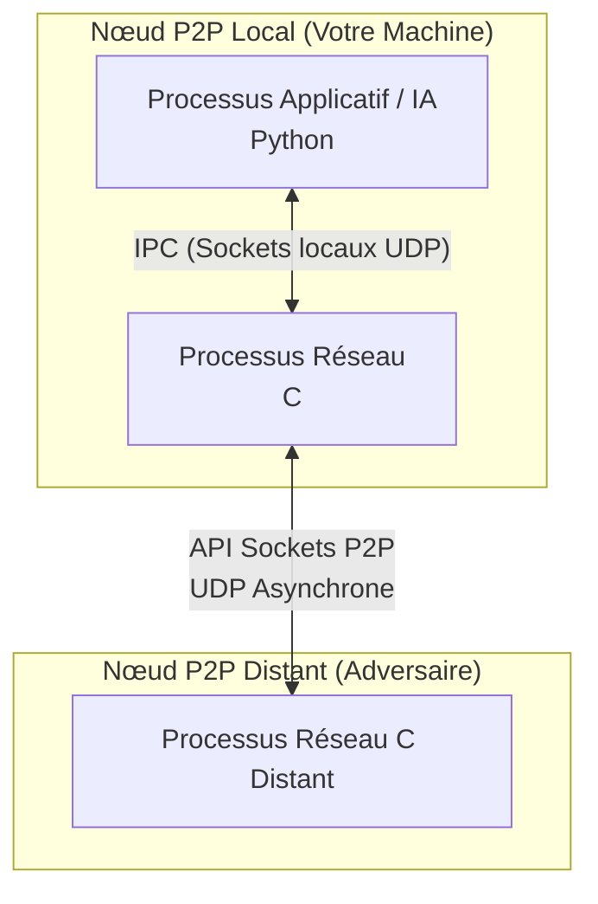
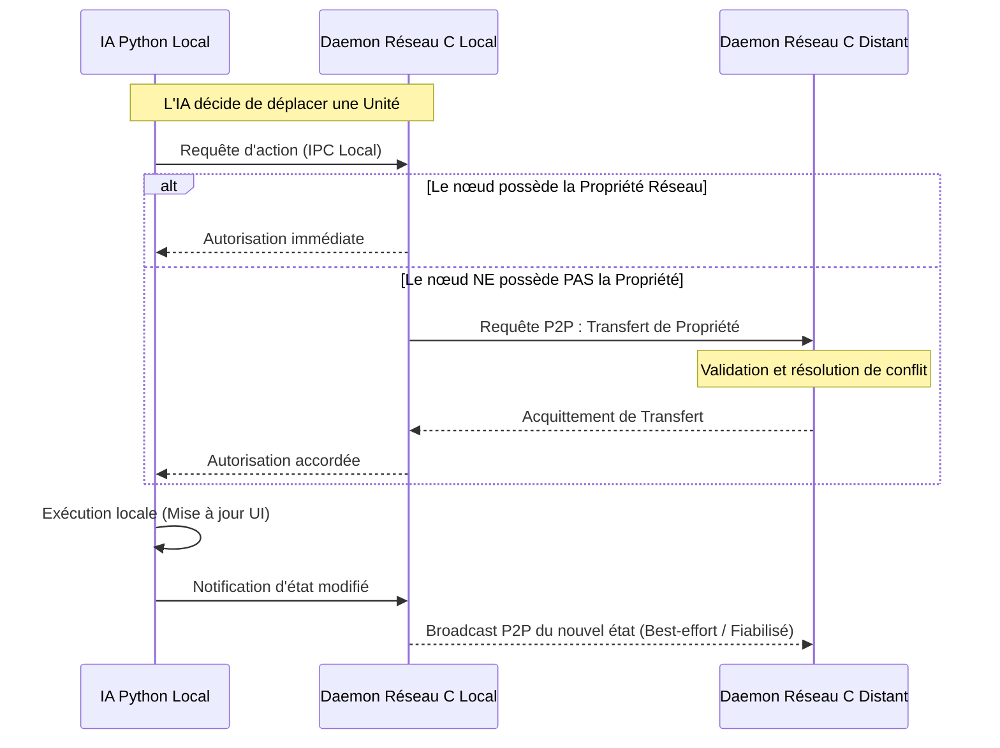

# MedievAIl Battle : Infrastructure Répartie pour Compétition d'IAs Distribuées

## 📌 Architecture Globale

Ce projet implémente une **infrastructure réseau décentralisée à large échelle** (pur Pair-à-Pair) pour un jeu de bataille stratégique. Le cœur du système repose sur une **séparation stricte des responsabilités en deux processus** distincts par machine afin d'isoler la logique de jeu de la gestion réseau :
1. **Processus Applicatif (Python)** : Gère la logique métier, l'Intelligence Artificielle, l'interface graphique et l'état de la partie.
2. **Processus Réseau (C)** : Gère exclusivement les communications inter-noeuds (sockets UDP/TCP asynchrones), le routage des paquets, et le maintien de la cohérence de l'état (protocole de consensus).

Les deux processus communiquent localement via un mécanisme de **Communication Inter-Processus (IPC)** (typiquement des sockets locaux). Cette architecture garantit que la logique de jeu n'est jamais bloquée par les lenteurs réseau, et inversement.



## 🔄 Diagramme de Séquence et Cohérence

L'enjeu principal d'une architecture sans serveur (Serverless) est d'éviter les modifications concurrentes contradictoires. Pour ce faire, le système implémente une notion de **"Propriété Réseau" (Network Ownership)**. 
Une entité n'a qu'un seul propriétaire légitime à un instant *t*. Si une IA locale veut modifier une entité, elle demande l'autorisation à son processus réseau local. Si ce nœud n'est pas propriétaire, il doit d'abord négocier le transfert de propriété avec les autres pairs avant que le Python ne soit autorisé à exécuter l'action.



## 📖 Historique des Versions

### 🔹 Version 1 : Jeu Local et Mode Best-Effort (Non Synchronisé)
La Version 1 constituait l'ébauche initiale du projet. Elle consistait principalement en :
- Une logique de jeu entièrement en **Python**.
- Une première tentative de mise en réseau basique où les actions étaient simplement diffusées sur le réseau en **"Best-Effort"** sans aucune garantie de réception ni ordre.
- **Résultat** : En raison de l'absence de gestion de concurrence, les actions simultanées provoquaient des conflits (des unités apparaissant en double, des "fantômes", et des désynchronisations majeures de l'état de la partie entre les joueurs).

### 🔹 Version 2 : Synchronisation Avancée, Architecture Hybride et Propriété Réseau
La Version 2 représente l'aboutissement de l'infrastructure répartie avec l'introduction du **C pour la couche réseau** :
- **Architecture Hybride C/Python** totalement opérationnelle via des sockets IPC.
- Implémentation du système de **Propriété Réseau** garantissant qu'aucun conflit ne peut survenir (une seule entité modifie un objet à la fois).
- Correction de tous les comportements aberrants (Anti-zombie, Anti-desync, victoire synchronisée).
- Mécanismes de "Timeout" et de récupération en cas de perte de paquets.

## ⚖️ Comparatif : Version 1 vs Version 2

| Caractéristique | Version 1 (Best-Effort) | Version 2 (Hybride Synchronisée) |
| :--- | :--- | :--- |
| **Langage de la couche réseau** | Python (Mock basique) | C (Sockets natifs POSIX / Winsock) |
| **Gestion des conflits** | Aucune (Écrasement d'état) | Système de Propriété Réseau (Consensus) |
| **Stabilité P2P** | Faible (Désynchronisations fréquentes) | Élevée (Anti-zombie, réconciliation d'état) |
| **Latence Applicative** | Bloquante par moments | Non-bloquante (Architecture multi-processus) |
| **Complexité Technique** | Simple | Avancée (IPC, Threads, Protocoles bas niveau) |

## 🚀 Comment Tester le Projet

### 🕹️ Tester la Version 1 (Mode Best-Effort / Désynchronisé)
Afin de visualiser pourquoi la Version 2 a été créée, vous pouvez tester la Version 1 qui montre les failles d'un réseau pur UDP sans protocole de cohérence :

Ouvrez 4 terminaux à la racine du projet :

**[Joueur 1 - Hôte]**
1. Lancer le routeur simulé en Python (Terminal 1) : `python p2p_node_mock.py 6000 127.0.0.1 6001 5000 5001 0`
2. Lancer le jeu (Terminal 2) : `python launch.py` *(Menu Choix 6 -> Zone 1 -> CRÉER)*

**[Joueur 2 - Client]**
3. Lancer le routeur simulé du client (Terminal 3) : `python p2p_node_mock.py 6001 127.0.0.1 6000 5002 5003 0`
4. Lancer le jeu (Terminal 4) : `python launch.py` *(Menu Choix 6 -> Zone 4 -> REJOINDRE)*

*Observez la désynchronisation en effectuant des actions simultanées des deux côtés.*

### 🛠️ Tester la Version 2 (Mode Synchronisé Hybride C/Python)
Pour tester la version finale stable, il faut utiliser l'exécutable réseau écrit en C :

**Étape Préalable : Compilation du réseau (C)**
```bash
gcc reseau.c -o reseau.exe -lws2_32
```
*(Sur Linux, supprimez `-lws2_32` et ajoutez `-lpthread`)*

Ouvrez 4 terminaux :

**[Joueur 1 - Hôte]**
1. Lancer le Daemon Réseau C (Terminal 1) : `./reseau.exe 6000 127.0.0.1 6001 5000 5001`
2. Lancer le jeu applicatif (Terminal 2) : `python launch.py` *(Créer une partie)*

**[Joueur 2 - Client]**
3. Lancer le Daemon Réseau C (Terminal 3) : `./reseau.exe 6001 127.0.0.1 6000 5002 5003`
4. Lancer le jeu applicatif (Terminal 4) : `python launch.py` *(Rejoindre la partie)*

*Les deux instances sont maintenant parfaitement synchronisées grâce au protocole de propriété réseau géré par les processus C !*
