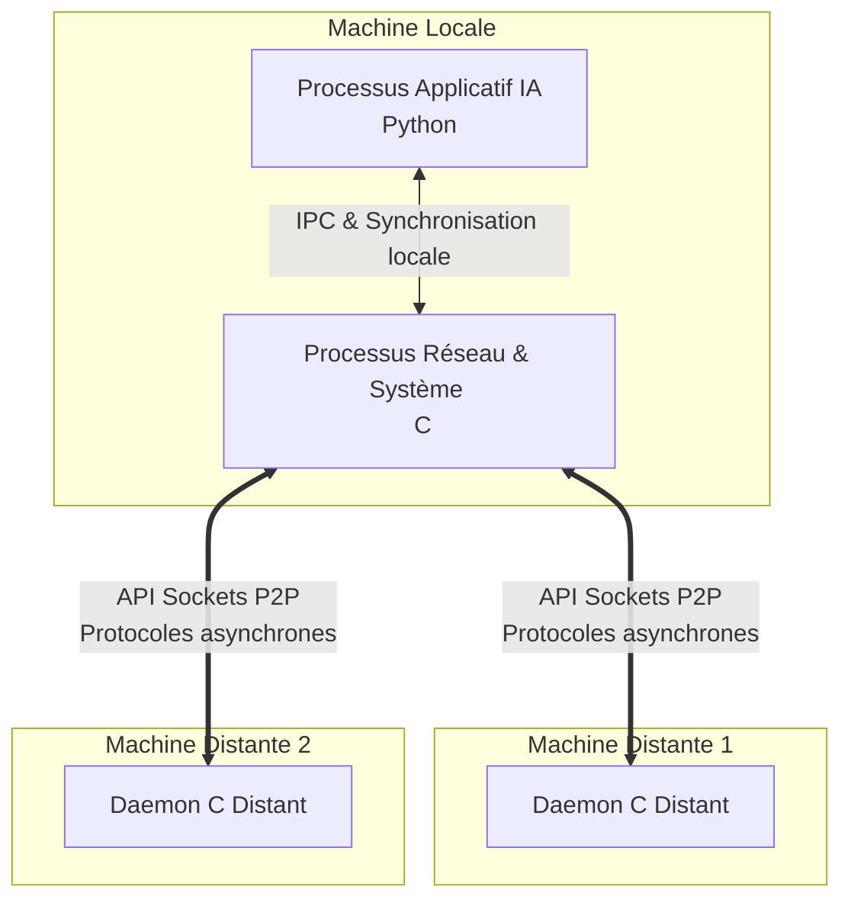
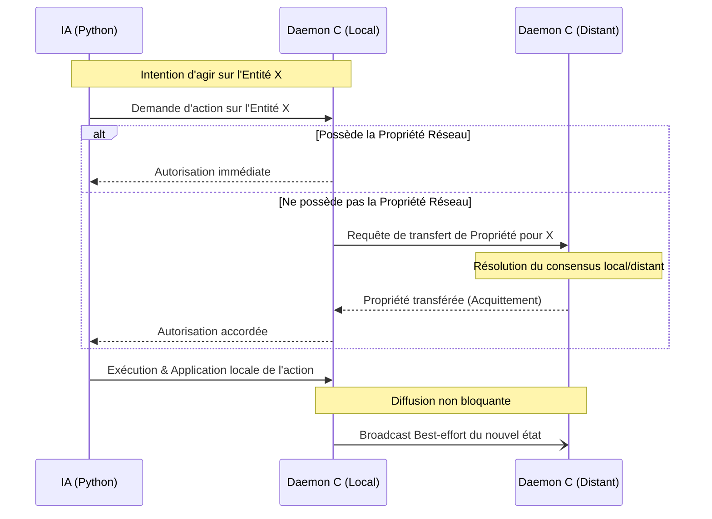

# Infrastructure Répartie pour Compétition d'IAs Distribuées

## 📌 Introduction et Objectifs
Ce projet implémente une **infrastructure réseau décentralisée à large échelle** permettant la compétition d'Intelligences Artificielles. Contrairement aux architectures client-serveur classiques, l'objectif est d'assurer une bataille multi-participants dans un environnement **pur Pair-à-Pair (P2P)**, sans aucun serveur central ou point de défaillance unique.
*(Auteur original du concept : Christian Toinard)*

## 🎯 Enjeux Techniques
L'absence de serveur central pose le défi majeur du **maintien de la cohérence de l'état distribué**. 
L'enjeu principal réside dans l'antinomie classique des systèmes répartis : **Cohérence vs Concurrence**. Comment garantir que deux processus distants ne modifient pas la même entité simultanément de manière conflictuelle tout en maintenant des performances d'exécution hautement concurrentes ? Le projet répond à cette problématique par une séparation stricte des responsabilités et un modèle de propriété innovant.

## ⚙️ Architecture Multi-Processus
Pour dissocier la logique applicative (l'IA) de la plomberie réseau et système, l'architecture impose une **séparation obligatoire en deux processus distincts** sur chaque machine locale :
1. **Le Processus Réseau (C) :** Gère les connexions non bloquantes, les Sockets de bas niveau, et les threads de routage. Il est responsable de la consistance inter-noeuds.
2. **Le Processus Applicatif / IA (Python) :** Évalue la scène, exécute les heuristiques et demande des actions.

Ces deux entités communiquent localement via des mécanismes de **Communication Inter-Processus (IPC)** (ex: sockets locaux, mémoires partagées ou files de messages) et s'appuient sur des primitives de synchronisation (Sémaphores/Mutex) pour éviter les accès concurrents locaux.

### Schéma de Déploiement Logiciel



## 🔒 Protocole de Cohérence Décentralisé
Pour résoudre les conflits sans arbitre centralisé, l'architecture s'appuie sur le concept de **"Propriété Réseau" (Network Ownership) cessible**.

Le modèle garantit l'intégrité de la scène (personnages, objets, cases) :
- Une entité (ex: une unité sur la carte) possède un unique "propriétaire" sur le réseau P2P à un instant $t$.
- Seul le nœud propriétaire a le droit d'altérer l'état de cette entité.
- Si une machine distante souhaite modifier cette entité, elle doit d'abord demander le transfert de la Propriété Réseau aux pairs.
- Une fois l'action effectuée par le propriétaire, le nouvel état est diffusé de manière **Best-effort** aux autres copies locales.

### Flux d'Exécution d'une Action



## 🛠️ Contexte Technique
- **Langages de programmation :** C (Couche Système, Routage et Réseau), Python (Couche Applicative et IA).
- **Infrastructures Systèmes :** Threads POSIX / Windows, Sémaphores, Mutex.
- **Réseau :** API Sockets UNIX/Windows (UDP/TCP), Communication Inter-Processus (IPC).

---

## 🚀 Comment tester la V1 en local
Afin de valider la conception "Best-Effort" (UDP sans garantie), vous pouvez simuler deux joueurs en concurrence sur un seul ordinateur. 

Ouvrez 4 terminaux à la racine du projet :

**[Joueur 1 - Hôte]**
1. Lancer le routeur de l'hôte (Terminal 1) :
   ```bash
   py p2p_node_mock.py 6000 127.0.0.1 6001 5000 5001 0
   ```
   *(Note : Si vous disposez de gcc, vous pouvez aussi compiler et utiliser `./network_poc/p2p_node.exe 6000 127.0.0.1 6001 5000 5001`)*

2. Lancer le jeu de l'hôte (Terminal 2) :
   ```bash
   py launch.py
   ```
   *(Choix 6 -> Sélectionner Zone 1 -> CRÉER)*

**[Joueur 2 - Client]**
3. Lancer le routeur du client (Terminal 3) :
   ```bash
   py p2p_node_mock.py 6001 127.0.0.1 6000 5002 5003 0
   ```
4. Lancer le jeu du client (Terminal 4) :
   ```bash
   py launch.py
   ```
   *(Choix 6 -> Sélectionner Zone 4 -> REJOINDRE)*

Dès que la partie commence, testez de placer des unités de chaque côté : le système fonctionnera en concurrence totale. Puisqu'il s'agit d'un réseau pur UDP sans blocage (Best-Effort), des actions brutales et simultanées pourront causer d'éventuelles désynchronisations (fantômes, rubber-banding), validant ainsi que le protocole ne bloque pas l'exécution.

---

## 🚀 Comment tester la Version 2 (P2P Synchronisé — 2 Joueurs)

Ouvrez **4 terminaux** à la racine du projet et lancez les commandes dans cet ordre :

> **Prérequis :** Compilez le routeur C une fois avec :
> ```bash
> gcc -o reseau.exe reseau.c -lws2_32
> ```
> Si vous n'avez pas `gcc`, utilisez le fallback Python `p2p_node_mock.py` (voir ci-dessous).

---

**Terminal 1 — Routeur réseau Joueur A (Hôte)**
```bash
.\reseau.exe 6000 A 5000 5001 127.0.0.1:6001
```
*Fallback Python (sans gcc) :*
```bash
py p2p_node_mock.py 6000 127.0.0.1 6001 5000 5001
```

**Terminal 2 — Jeu Joueur A**
```bash
py launch.py
```
*(Dans le menu : Multijoueur P2P → Choisir une Zone → **CRÉER**)*

---

**Terminal 3 — Routeur réseau Joueur B (Client)**
```bash
.\reseau.exe 6001 B 5002 5003 127.0.0.1:6000
```
*Fallback Python (sans gcc) :*
```bash
py p2p_node_mock.py 6001 127.0.0.1 6000 5002 5003
```

**Terminal 4 — Jeu Joueur B**
```bash
py launch.py
```
*(Dans le menu : Multijoueur P2P → Choisir une Zone → **REJOINDRE**)*

> **Note :** Si les deux joueurs choisissent la même zone, le système de collision la résout automatiquement en déplaçant le client à la zone opposée.

---

## 🚀 Comment tester la Version 3 (P2P Multi — 3 Joueurs)

La V3 supporte **N joueurs simultanés** grâce à la table de pairs dynamique (`g_peers[]`) et au protocole de découverte HELLO/HELLO_ACK intégré dans `reseau.exe`.

Ouvrez **6 terminaux** à la racine du projet :

> **Prérequis :** Même compilation que ci-dessus.

---

**Terminal 1 — Routeur Joueur A**
```bash
.\reseau.exe 6000 A 5000 5001 127.0.0.1:6001 127.0.0.1:6002
```

**Terminal 2 — Jeu Joueur A**
```bash
py launch.py
```
*(Multijoueur P2P → **MODE 3 JOUEURS** → Identifiant **Joueur A** → **CRÉER**)*

---

**Terminal 3 — Routeur Joueur B**
```bash
.\reseau.exe 6001 B 5002 5003 127.0.0.1:6000 127.0.0.1:6002
```

**Terminal 4 — Jeu Joueur B**
```bash
py launch.py
```
*(Multijoueur P2P → **MODE 3 JOUEURS** → Identifiant **Joueur B** → **CRÉER**)*

---

**Terminal 5 — Routeur Joueur C**
```bash
.\reseau.exe 6002 C 5004 5005 127.0.0.1:6000 127.0.0.1:6001
```

**Terminal 6 — Jeu Joueur C**
```bash
py launch.py
```
*(Multijoueur P2P → **MODE 3 JOUEURS** → Identifiant **Joueur C** → **CRÉER**)*

---

### Déploiement des armées (V3)

| Joueur | Zone de départ | Couleur |
|--------|----------------|---------|
| A      | Nord-Ouest     | 🔵 Bleu  |
| B      | Nord-Est       | 🔴 Rouge |
| C      | Sud-Centre     | 🟢 Vert  |

La partie démarre automatiquement dès que les 3 joueurs ont échangé leurs choix via le handshake réseau (`setup_choice_3p`). Le premier joueur à éliminer les deux autres armées remporte la bataille.

### Syntaxe complète de `reseau.exe`

```
reseau.exe <port_net> <player_id> <ipc_in> <ipc_out> [peer1_ip:port] [peer2_ip:port] ...
```

| Argument       | Description                                      | Exemple        |
|----------------|--------------------------------------------------|----------------|
| `port_net`     | Port UDP réseau P2P de ce nœud                   | `6000`         |
| `player_id`    | Identifiant de ce joueur (`A`, `B`, `C`…)        | `A`            |
| `ipc_in`       | Port d'écoute des messages depuis Python         | `5000`         |
| `ipc_out`      | Port de renvoi vers Python                       | `5001`         |
| `peerN_ip:port`| Pairs initiaux connus (découverte automatique)   | `127.0.0.1:6001` |
