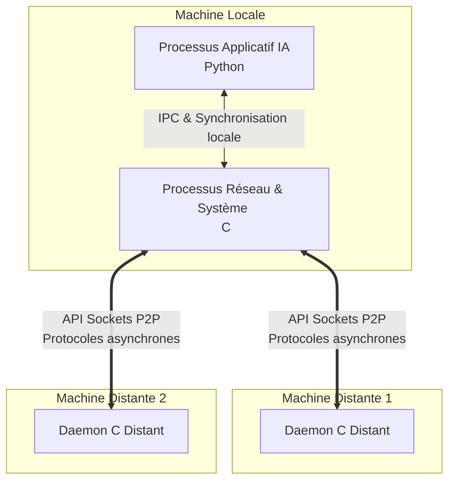
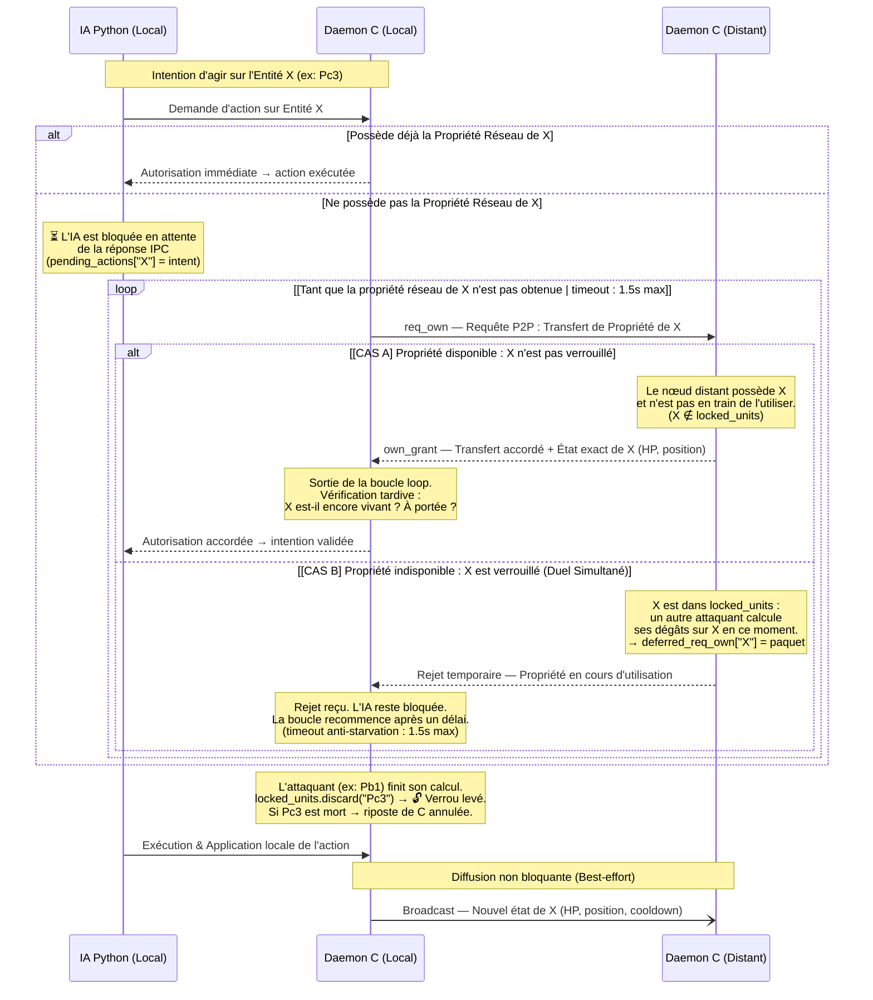

# Infrastructure Répartie pour Compétition d'IAs Distribuées

## 📌 Introduction et Objectifs
Ce projet implémente une **infrastructure réseau décentralisée à large échelle** permettant la compétition d'Intelligences Artificielles. Contrairement aux architectures client-serveur classiques, l'objectif est d'assurer une bataille multi-participants dans un environnement **pur Pair-à-Pair (P2P)**, sans aucun serveur central ou point de défaillance unique.
*(Auteur original du concept : Christian Toinard)*

## 🎯 Enjeux Techniques
L'absence de serveur central pose le défi majeur du **maintien de la cohérence de l'état distribué**. 
L'enjeu principal réside dans l'antinomie classique des systèmes répartis : **Cohérence vs Concurrence**. Comment garantir que deux processus distants ne modifient pas la même entité simultanément de manière conflictuelle tout en maintenant des performances d'exécution hautement concurrentes ? Le projet répond à cette problématique par une séparation stricte des responsabilités et un modèle de propriété innovant.

## ⚙️ Architecture Multi-Processus
Pour dissocier la logique applicative (l'IA) de la plomberie réseau et système, l'architecture impose une **séparation obligatoire en deux processus distincts** sur chaque machine locale :
1. **Le Processus Réseau (C) :** Gère les connexions non bloquantes, les Sockets de bas niveau, et les threads de routage. Il est responsable de la consistance inter-noeuds.
2. **Le Processus Applicatif / IA (Python) :** Évalue la scène, exécute les heuristiques et demande des actions.

Ces deux entités communiquent localement via des mécanismes de **Communication Inter-Processus (IPC)** (ex: sockets locaux, mémoires partagées ou files de messages) et s'appuient sur des primitives de synchronisation (Sémaphores/Mutex) pour éviter les accès concurrents locaux.

### Schéma de Déploiement Logiciel



## 🔒 Protocole de Cohérence Décentralisé
Pour résoudre les conflits sans arbitre centralisé, l'architecture s'appuie sur le concept de **"Propriété Réseau" (Network Ownership) cessible**.

Le modèle garantit l'intégrité de la scène (personnages, objets, cases) :
- Une entité (ex: une unité sur la carte) possède un unique "propriétaire" sur le réseau P2P à un instant $t$.
- Seul le nœud propriétaire a le droit d'altérer l'état de cette entité.
- Si une machine distante souhaite modifier cette entité, elle doit d'abord demander le transfert de la Propriété Réseau aux pairs.
- Une fois l'action effectuée par le propriétaire, le nouvel état est diffusé de manière **Best-effort** aux autres copies locales.

### Flux d'Exécution d'une Action



## 🛠️ Contexte Technique
- **Langages de programmation :** C (Couche Système, Routage et Réseau), Python (Couche Applicative et IA).
- **Infrastructures Systèmes :** Threads POSIX / Windows, Sémaphores, Mutex.
- **Réseau :** API Sockets UNIX/Windows (UDP/TCP), Communication Inter-Processus (IPC).

---

## 🚀 Comment tester la V1 en local
Afin de valider la conception "Best-Effort" (UDP sans garantie), vous pouvez simuler deux joueurs en concurrence sur un seul ordinateur. 

Ouvrez 4 terminaux à la racine du projet :

**[Joueur 1 - Hôte]**
1. Lancer le routeur de l'hôte (Terminal 1) :
   ```bash
   py p2p_node_mock.py 6000 127.0.0.1 6001 5000 5001 0
   ```
   *(Note : Si vous disposez de gcc, vous pouvez aussi compiler et utiliser `./network_poc/p2p_node.exe 6000 127.0.0.1 6001 5000 5001`)*

2. Lancer le jeu de l'hôte (Terminal 2) :
   ```bash
   py launch.py
   ```
   *(Choix 6 -> Sélectionner Zone 1 -> CRÉER)*

**[Joueur 2 - Client]**
3. Lancer le routeur du client (Terminal 3) :
   ```bash
   py p2p_node_mock.py 6001 127.0.0.1 6000 5002 5003 0
   ```
4. Lancer le jeu du client (Terminal 4) :
   ```bash
   py launch.py
   ```
   *(Choix 6 -> Sélectionner Zone 4 -> REJOINDRE)*

Dès que la partie commence, testez de placer des unités de chaque côté : le système fonctionnera en concurrence totale. Puisqu'il s'agit d'un réseau pur UDP sans blocage (Best-Effort), des actions brutales et simultanées pourront causer d'éventuelles désynchronisations (fantômes, rubber-banding), validant ainsi que le protocole ne bloque pas l'exécution.

---

## 🚀 Test Version 2 — P2P Synchronisé (Daemon C natif)

Le routeur réseau est implémenté en **C pur** (`reseau.c`). Compilez-le une fois avant le test :

```bash
compile.bat
```
*(Cela génère `reseau.exe` — ne nécessite qu'une seule compilation)*

---

Ouvrez ensuite **4 terminaux** à la racine du projet et lancez les commandes dans cet ordre :

> ⚠️ **Ordre obligatoire** : lancez les daemons C (T1 et T3) **avant** les jeux Python (T2 et T4).

**Terminal 1 — Daemon C Joueur A**
```bash
.\reseau.exe 6000 127.0.0.1 6001 5000 5001
```

**Terminal 2 — Jeu Joueur A**
```bash
py launch.py
```

**Terminal 3 — Daemon C Joueur B**
```bash
.\reseau.exe 6001 127.0.0.1 6000 5002 5003
```

**Terminal 4 — Jeu Joueur B**
```bash
py launch.py
```

### ✅ Messages attendus dans les terminaux (preuve que le protocole fonctionne)

| Message | Signification |
|---|---|
| `[IPC -> NET] Envoi vers 127.0.0.1:600x` | Le daemon C route un paquet du jeu vers l'adversaire |
| `[NET -> IPC] Recu de 127.0.0.1:600x` | Le daemon C reçoit un paquet réseau et le transmet au jeu local |
| `[A] Action validée pour A_X sur B_Y` | Propriété accordée, attaque exécutée |
| `[A] Action annulée : cible trop loin` | Vérification tardive — cible déplacée pendant la négociation |
| `[B] ♟️ Réclamation de notre unité B_X` | Réclamation légitime — B reprend son unité après l'attaque de A |
| `[B] Propriété reçue HP=...` | Synchronisation d'état parfaite entre les deux instances |
| `🔒 Unité X verrouillée. Rejet envoyé` | Duel Simultané — verrou d'attaque actif (CAS B du diagramme) |
| `⏳ Rejet reçu pour X. Retry dans 0.5s` | Boucle loop active — retry après cooldown |
