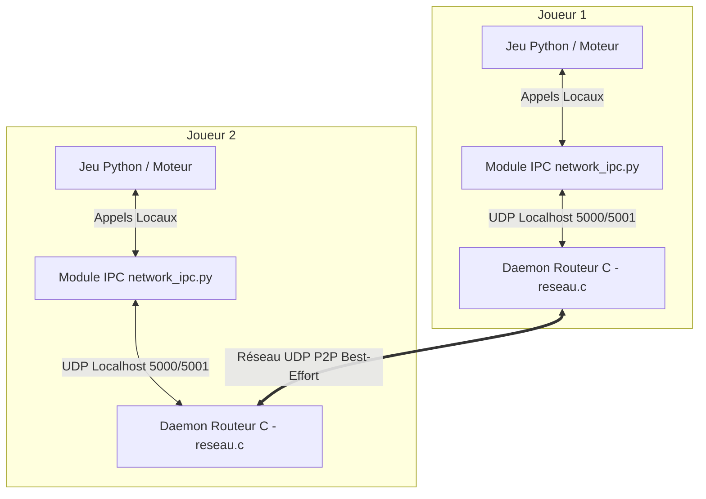
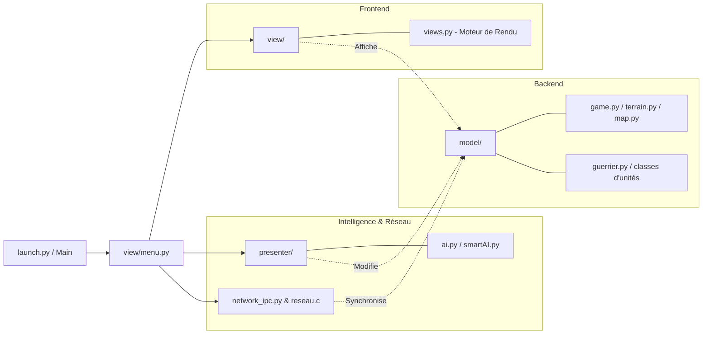

# MedievAIl Battle Simulator

## 📌 Présentation du Projet
**MedievAIl Battle Simulator** est un simulateur de batailles médiévales en temps réel, conçu pour expérimenter des comportements d'intelligence artificielle (IA) tactiques et des concepts avancés de réseau pair-à-pair (P2P).

Le projet permet à différentes armées (Chevaliers, Piquiers, Arbalétriers) de s'affronter sur des terrains variés générés dynamiquement. Il supporte un mode **Multijoueur P2P** où deux joueurs peuvent faire s'affronter leurs armées et placer dynamiquement des troupes sur le champ de bataille en concurrence sauvage.

## 🎯 Objectifs
- **Simulation Stratégique :** Développer un moteur de jeu performant où le terrain (élévation) impacte directement l'issue des combats.
- **Multijoueur Décentralisé :** S'affranchir d'un serveur central via une architecture P2P robuste permettant la synchronisation d'état (Army Sync).
- **Intelligence Artificielle :** Mettre en œuvre différentes IAs (agressives, défensives, prédictives) capables d'exploiter les spécificités du terrain et des compositions d'armées.

## ⚙️ Enjeux Techniques
1. **Best-Effort Réseau (UDP) :** Le jeu accepte l'apparition d'incohérences (rubber-banding, désynchronisation mineure) lors de modifications brutales, simulant fidèlement la nature non fiable (best-effort) des réseaux sans garanties strictes de livraison ou d'ordre.
2. **Génération par Seed (Graines) :** Génération locale et consistante des terrains infinis entre les joueurs en utilisant des graines partagées pour éviter de saturer la bande passante avec des données topographiques.
3. **Synchronisation Inter-Processus (IPC) :** Le jeu sépare sa logique réseau (en langage C, pour des performances réseau de bas niveau et gestion asynchrone native) de la logique de simulation (en Python).

---

## 🏗️ Architecture du Projet

Le système repose sur un couplage fort entre l'application graphique (Python) et un routeur P2P (C). Ils communiquent localement via IPC (sockets UDP).



## 📂 Organisation du Code Source

Le code Python est architecturé selon le modèle de conception **MVC (Modèle-Vue-Présentateur/Contrôleur)**.



### Description des Dossiers
- **`model/`** : Cœur de la simulation (règles, entités, grille de terrain, logiques de dégâts).
- **`view/`** : Moteur de rendu graphique développé sous *Pygame* (caméra isométrique, menus).
- **`presenter/`** : Contrôleurs IAs (Captain Braindead, General Strategus) pilotant les armées.
- **`reseau.c`** : Daemon réseau compilé gérant l'émission et la réception pure des datagrammes vers l'extérieur.
- **`network_ipc.py`** : Client IPC permettant la liaison Python ↔ C.

---

## 🚀 Comment Lancer

1. **Compiler le routeur P2P (Si nécessaire) :**
   ```bash
   gcc reseau.c -o network_poc/p2p_node
   ```
2. **Lancer le jeu :**
   ```bash
   python launch.py
   ```
   *(Vous pouvez choisir de lancer des scénarios solo ou créer/rejoindre une session Multijoueur via le menu principal).*
