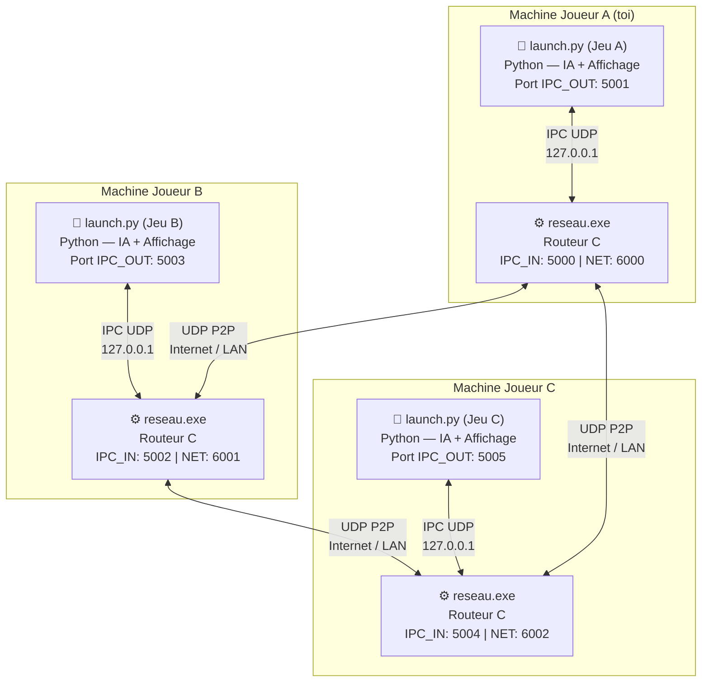
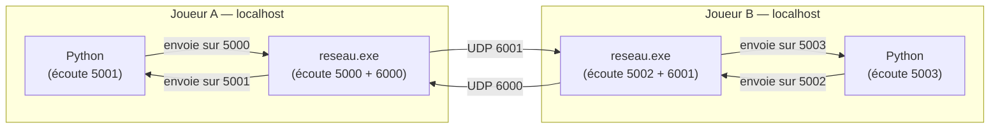
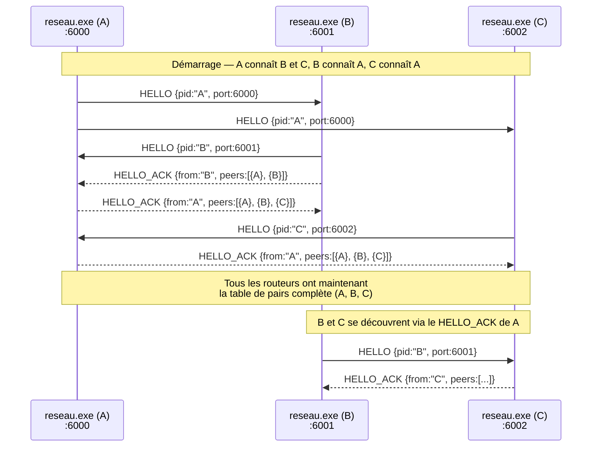
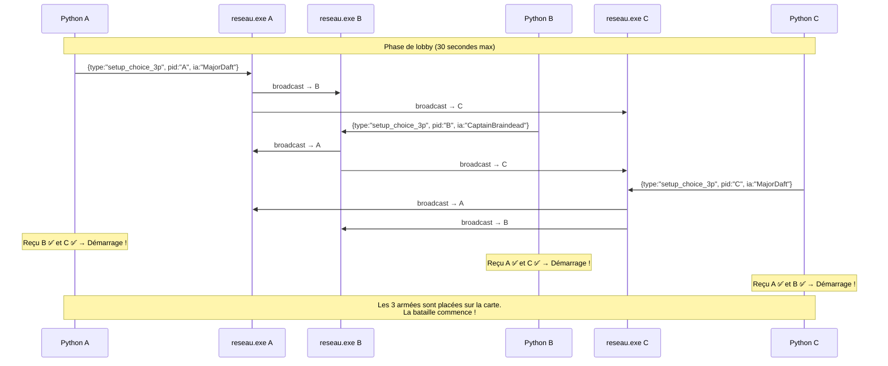
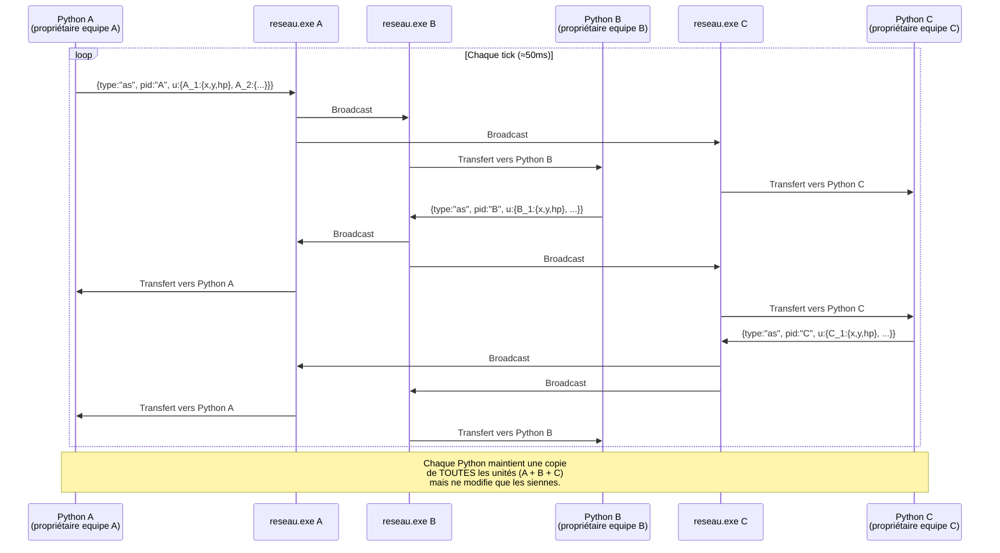
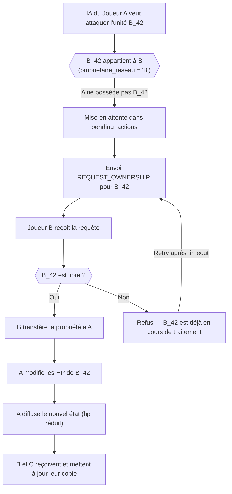
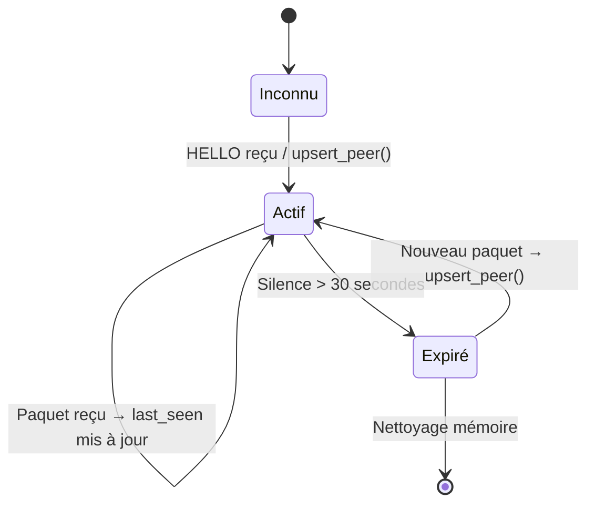

# 🌐 Architecture Réseau — Mode 3 Joueurs P2P

Ce document explique en détail comment fonctionne la couche réseau du simulateur de bataille **MedievAIl** lorsque 3 joueurs s'affrontent en mode P2P décentralisé.

---

## 1. Vue d'ensemble — Qui parle à qui ?

Dans ce système, **il n'y a aucun serveur central**. Chaque joueur dispose de deux processus qui tournent sur sa machine :

- **`reseau.exe`** — le routeur réseau (écrit en C), qui gère les sockets UDP
- **`launch.py`** — le jeu (écrit en Python), qui contient l'IA et l'affichage

Ces deux processus communiquent entre eux via une technique appelée **IPC** (Inter-Process Communication) à base de sockets UDP locaux (loopback `127.0.0.1`).



> **Règle clé :** Le Python ne parle **jamais** directement à une autre machine. Il passe toujours par son routeur C local.

---

## 2. Ports utilisés (test local sur un seul PC)

Quand les 3 joueurs tournent sur la **même machine**, les ports ne doivent pas se chevaucher :

| Joueur | IPC_IN (C écoute Python) | IPC_OUT (Python écoute C) | Port Réseau P2P |
|--------|--------------------------|---------------------------|-----------------|
| **A**  | `5000`                   | `5001`                    | `6000`          |
| **B**  | `5002`                   | `5003`                    | `6001`          |
| **C**  | `5004`                   | `5005`                    | `6002`          |



---

## 3. Découverte des pairs — HELLO / HELLO_ACK

Quand un routeur démarre, il ne connaît pas forcément tous les autres joueurs. Il envoie un message `HELLO` à ceux qu'on lui a indiqués en argument, et ceux-ci répondent avec un `HELLO_ACK` contenant leur liste de pairs.



> **Résultat :** Même si C ne connaît que A au démarrage, il découvrira B automatiquement via le `HELLO_ACK` que A lui envoie.

---

## 4. Lobby — Synchronisation des 3 joueurs avant la partie

Avant de lancer le combat, les 3 processus Python doivent se synchroniser pour choisir leur IA et confirmer leur présence. Ils s'envoient mutuellement un message `setup_choice_3p`.



---

## 5. Combat — Synchronisation de l'état en temps réel

Pendant la bataille, chaque joueur **ne contrôle que ses propres unités** (propriété réseau). À chaque tick de jeu, il envoie l'état de ses unités à tous les autres.



---

## 6. Propriété réseau — Qui a le droit de modifier quoi ?

Chaque unité a un **propriétaire réseau** (son `pid`). Seul le propriétaire peut modifier les PV de ses unités ou les déplacer.



---

## 7. Résumé — Table de pairs dans `reseau.exe`

Le cœur de la nouveauté v3 est la **table de pairs dynamique** dans le C :

```
g_peers[] = [
  { ip: "127.0.0.1", port: 6001, player_id: "B", last_seen: T },
  { ip: "127.0.0.1", port: 6002, player_id: "C", last_seen: T },
]
```

- **`upsert_peer()`** : Ajoute ou met à jour un pair (appelé à chaque paquet reçu)
- **`broadcast_to_peers()`** : Envoie un paquet à **tous** les pairs actifs
- **Expiration** : Un pair qui n'a pas envoyé de paquet depuis 30 secondes est marqué inactif



---

## 8. Commandes de démarrage (rappel)

### Sur un seul PC (test local)

```bash
# Terminal 1 — Routeur A
.\reseau.exe 6000 A 5000 5001 127.0.0.1:6001 127.0.0.1:6002

# Terminal 2 — Jeu A
py launch.py   # → 6 → MODE 3 JOUEURS → Joueur A → CRÉER

# Terminal 3 — Routeur B
.\reseau.exe 6001 B 5002 5003 127.0.0.1:6000 127.0.0.1:6002

# Terminal 4 — Jeu B
py launch.py   # → 6 → MODE 3 JOUEURS → Joueur B → CRÉER

# Terminal 5 — Routeur C
.\reseau.exe 6002 C 5004 5005 127.0.0.1:6000 127.0.0.1:6001

# Terminal 6 — Jeu C
py launch.py   # → 6 → MODE 3 JOUEURS → Joueur C → CRÉER
```

### Sur 3 PCs différents (réseau LAN)

Remplacez `127.0.0.1` par les vraies adresses IP des autres machines :

```bash
# Sur PC_A (IP: 192.168.1.10) — Routeur A
.\reseau.exe 6000 A 5000 5001 192.168.1.20:6001 192.168.1.30:6002

# Sur PC_B (IP: 192.168.1.20) — Routeur B
.\reseau.exe 6001 B 5002 5003 192.168.1.10:6000 192.168.1.30:6002

# Sur PC_C (IP: 192.168.1.30) — Routeur C
.\reseau.exe 6002 C 5004 5005 192.168.1.10:6000 192.168.1.20:6001
```

> **Note :** Même si vous ne connaissez pas l'IP de C au démarrage, A peut servir de **bootstrap** : donnez uniquement A en pair initial, et A transmettra automatiquement la liste complète via HELLO_ACK.

---

## 9. Format des messages réseau (JSON)

| Type | Direction | Contenu | Usage |
|------|-----------|---------|-------|
| `HELLO` | C → C | `{type, pid, port}` | Annonce sa présence |
| `HELLO_ACK` | C → C | `{type, from, peers:[...]}` | Répond avec la liste des pairs |
| `setup_choice_3p` | Python → Python | `{type, pid, ia}` | Synchronisation du lobby |
| `as` (army_sync) | Python → Python | `{type, pid, u:{uid:{x,y,hp,cd}}}` | État des unités en temps réel |
| `req_own` | Python → Python | `{type, uid, from}` | Demande de propriété d'une unité |
| `ack` | C → Python | `{type, status}` | Accusé de réception IPC interne |
